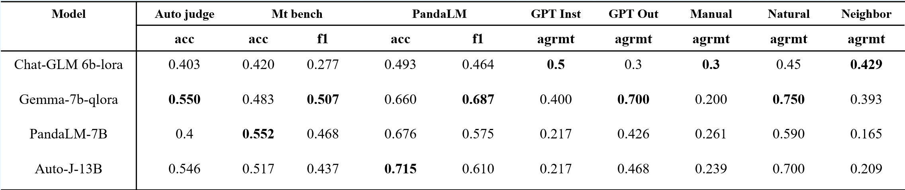

# Train your LLM judge model using multi training dataset in a unified manner.


## Prepare Data

1. make raw data dir by running [Data/make_raw_files_dir.sh](Data/make_raw_files_dir.sh)
2. Download raw files.
    Download raw/auto_judge/pairwise_traindata.jsonl at [pairwise_traindata.jsonl](https://github.com/GAIR-NLP/auto-j/blob/main/data/training/pairwise_traindata.jsonl).

    Download raw/auto_judge/testdata_pairwise.jsonl at [testdata_pairwise.jsonl](https://github.com/GAIR-NLP/auto-j/blob/main/data/test/testdata_pairwise.jsonl).

    Download raw/llm_bar/GPTInst/dataset.json at [result.json](https://github.com/princeton-nlp/LLMBar/blob/main/Dataset/LLMBar/Adversarial/GPTInst/evaluators/GPT-4/CoT/result.json).

    Download raw/llm_bar/GPTOut/dataset.json at [result.json](https://github.com/princeton-nlp/LLMBar/blob/main/Dataset/LLMBar/Adversarial/GPTOut/evaluators/GPT-4/CoT/result.json).

    Download raw/llm_bar/Manual/dataset.json at [result.json](https://github.com/princeton-nlp/LLMBar/blob/main/Dataset/LLMBar/Adversarial/Manual/evaluators/GPT-4/CoT/result.json).

    Download raw/llm_bar/Natural/dataset.json at [result.json](https://github.com/princeton-nlp/LLMBar/blob/main/Dataset/LLMBar/Natural/evaluators/GPT-4/CoT/result.json).

    Download raw/llm_bar/Neighbor/dataset.json at [result.json](https://github.com/princeton-nlp/LLMBar/blob/main/Dataset/LLMBar/Adversarial/Neighbbor/evaluators/GPT-4/CoT/result.json).

    Download raw/mt_bench/gpt-4_pair.jsonl at [gpt-4_pair.jsonl](https://huggingface.co/spaces/lmsys/mt-bench/resolve/main/data/mt_bench/model_judgment/gpt-4_pair.jsonl).

    Download raw/panda_lm/pandalm_test.json at [pandalm_test.json](https://github.com/WeOpenML/PandaLM/blob/main/data/testset-v1.json).
3. format the raw data into unified data format by running corresponding scripts in [Data/scripts/process](Data/scripts/process).

4. combine the formatted data to openai format by running [Data/scripts/prompts/combine.py](Data/scripts/prompts/combine.py) and generate the same format test data by running [Data/scripts/prompts/combine_test.py](Data/scripts/prompts/combine_test.py).

5. soft line the output openai format training file to [LLaMA-Factory/data](LLaMA-Factory/data) and add an entry in  [dataset_info.json](LLaMA-Factory/data/dataset_info.json) to fit LLaMA-Factory training pipeline, here is an example:
```json
  "train_openai": {
    "file_name": "train_openai.json",
    "formatting": "sharegpt",
    "columns": {
      "messages": "messages"
    },
    "tags": {
      "role_tag": "role",
      "content_tag": "content",
      "user_tag": "user",
      "assistant_tag": "assistant",
      "system_tag": "system"
    }
  },
```

## Download Pretrain models

See [LLaMA-Factory](https://github.com/hiyouga/LLaMA-Factory) for supported pretrain large language models, create a sub-folder `Models` and put the pretrained checkpoints in it.

## Fine-tuning your Judge Model! 

Reference our training examples in [Train scripts](Train_scripts), note that configs of these examples are saved in [Configs](Configs).

## Test Judge Model performance

See test scripts in [Test scripts](Test_scripts) for more details, Judge Models are tested on PandaLM, LLM bar, MT bench and Auto-j test sets with respect to human preference.